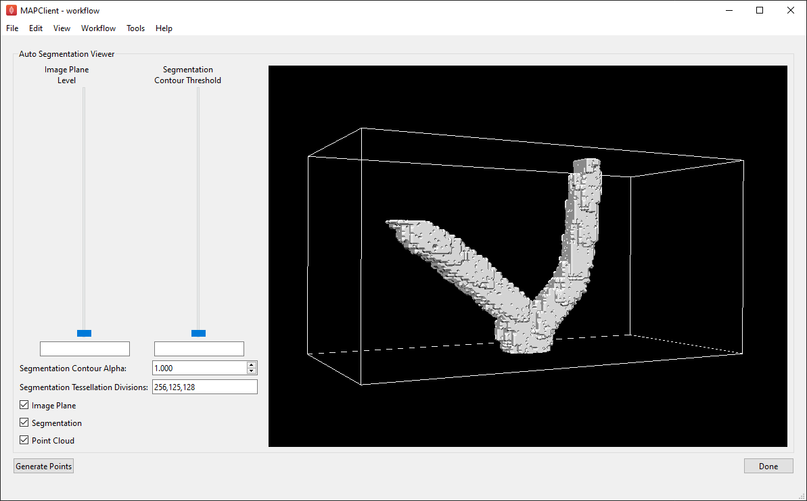
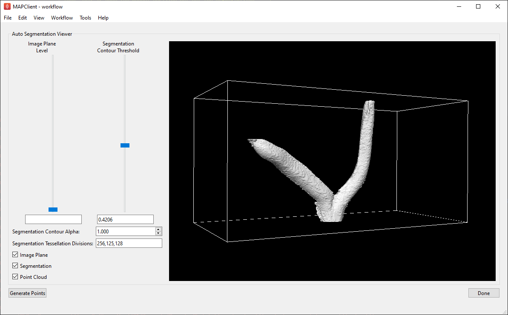
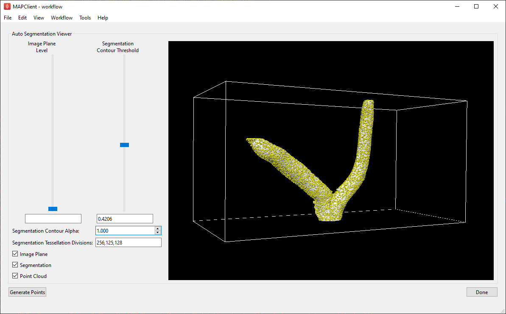

Auto Segmentation Step
======================

Overview
--------

The **Auto Segmentation** step is an interactive segmentation plugin for the MAP-Client.

This tool takes a stack of images as an input and uses the contours of these images to generate a 3D `Zinc` surface mesh. Additionally, it
also has the ability to generate a `Zinc` point cloud over the surface of the mesh. The **Auto Segmentation** step outputs a `Zinc`
compatible EX file containing the generated mesh and point-cloud objects.

The **Auto Segmentation** tool uses the `Zinc Widgets` library to provide graphical user interfaces for the underlying `Zinc` actions.

This document details the steps required to setup and use the **Auto Segmentation** tool in the MAP-Client.

Workflow Connections
--------------------

The workflow connections for the **Auto Segmentation** step are shown in :numref:`fig-auto-segmentation-workflow`.

It takes a single input:

1. A stack of images to be used for the segmentation.

`The MAP` **Image Source** `step can be used to create the image stack data required by the` **Auto Segmentation** `step`.

It provides a single output:

1. A `Zinc library` compatible EX file containing the point cloud and segmentation mesh generated by the segmentation.

`This output port can be connected to a` **File Location Sink** `step or to any additional MAP workflow step that accepts an EX file.`

.. _fig-auto-segmentation-workflow:

.. figure:: _images/auto-segmentation-workflow.png
   :figwidth: 100%
   :align: center

   **Auto Segmentation** workflow connections.

Usage
-----

To setup an auto segmentation workflow add an **Image Source** step and an **Auto Segmentation** step to the workflow area. Edit the
**Image Source** step configuration to define the directory where the images for the segmentation are saved. Once this step has been
configured, connect its output port to the input port of the segmentation step - as in :numref:`fig-auto-segmentation-workflow`. The
segmentation step will be configured by default as it doesn't have any configuration settings that need set. What you connect the
**Auto Segmentation** output port to depends on your objective. In :numref:`fig-auto-segmentation-workflow` we have connected the output
port to a **File Location Sink** step - allowing us to define a local directory where the output file will be saved.

Once we have the workflow set up, save it and click the `Execute` button to start the **Auto Segmentation** GUI.

When the tool loads for the first time you should see something like the image displayed in :numref:`fig-auto-segmentation-initial`.

.. _fig-auto-segmentation-initial:

   **Auto Segmentation** user interface just after loading.

The view window visualises a box outlining the dimensions of the image stack. In this box you should see a plane showing the image at the
current level in the image stack, and a 3D surface showing the contours of the segmented image data.

The `Image Plane Level` slider can be used to cycle through the input images and can be helpful for determining a satisfactory threshold for
the segmentation contour graphics. The `Segmentation Contour Threshold` slider is used to set the image intensity threshold that the
segmentation contour graphics are created at. If the segmentation graphics look angular or rough, or if they are not initially visible, try
experimenting with the `Segmentation Contour Threshold` slider to adjust the shape of the surface:

.. _fig-auto-segmentation-threshold:

   Segmentation graphics after adjusting the `Segmentation Contour Threshold` slider.

You can further smooth out the surface graphics by adjusting the `Segmentation Tessellation Divisions`. This changes the number of
triangular elements that are created over the surface of the mesh, making it more or less smooth. Note that significantly increasing the
tessellation divisions will slow down the generation and visualisation of the surface graphics, so it is recommended that you only try this
after setting an adequate threshold value. Increasing the tessellation divisions beyond the dimensions of the image stack is not recommended
and is unlikely to improve the quality of the graphics.

Once you are satisfied with the shape of the segmentation mesh click `Generate Points` to generate a point cloud over its surface.

.. _fig-auto-segmentation-points:

   Points generated over the surface of the segmentation contour graphics.

You may adjust the segmentation settings and re-generate the point cloud as many time as necessary to achieve a result you are satisfied
with.

All user interface settings and generated graphics are saved and will be re-loaded the next time you start the **Auto Segmentation** tool.

Clicking the `Done` button will output the mesh and point cloud to a `Zinc` EX file and will execute any additional workflow steps connected
to the **Auto Segmentation** step. Currently the `Zinc` mesh and point-cloud objects are both written to the same EX file.
