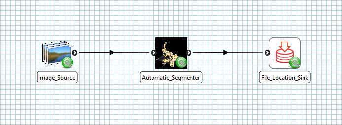

.. _mcp-autosegmentation-workflow-setup:

Workflow Setup
--------------

To setup an auto segmentation workflow add an **Image Source** step and an **Auto Segmentation** step to the workflow area. Edit the
**Image Source** step configuration to define the directory where the images for the segmentation are saved. Once this step has been
configured, connect its output port to the input port of the segmentation step - as in :ref:`Fig. 1 <fig-auto-segmentation-workflow>`. The
segmentation step will be configured by default as it doesn't have any configuration settings that need set. What you connect the
**Auto Segmentation** output ports to depends on your objective. In :ref:`Fig. 1 <fig-auto-segmentation-workflow>` we have connected each
of the output ports to a **File Location Sink** step - allowing us to define a local directory where the output files will be saved.

.. _fig-auto-segmentation-workflow:

   **Auto Segmentation** workflow connections.

Once we have the workflow set up, save it and click the `Execute` button to start the **Auto Segmentation** GUI.